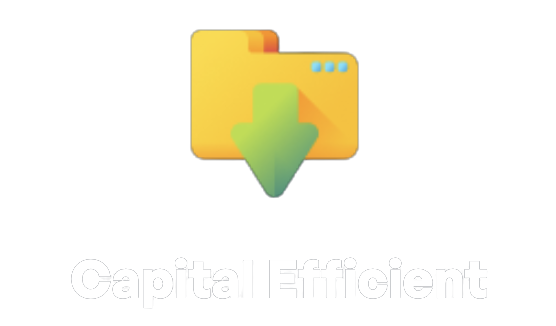

# 🔹 Heading Proton

<figure><figcaption></figcaption></figure>

 

<figure><figcaption></figcaption></figure>

 

<figure><figcaption></figcaption></figure>

|                    High Returns                   |         Capital Efficient        |                                           All-in-one Solution                                          |
| :-----------------------------------------------: | :------------------------------: | :----------------------------------------------------------------------------------------------------: |
| _Access to best yield optimization opportunities_ | _Get more out of your liquidity_ | _First DeFi platform in the industry to combine a concentrated DEX with a liquidity management system_ |

