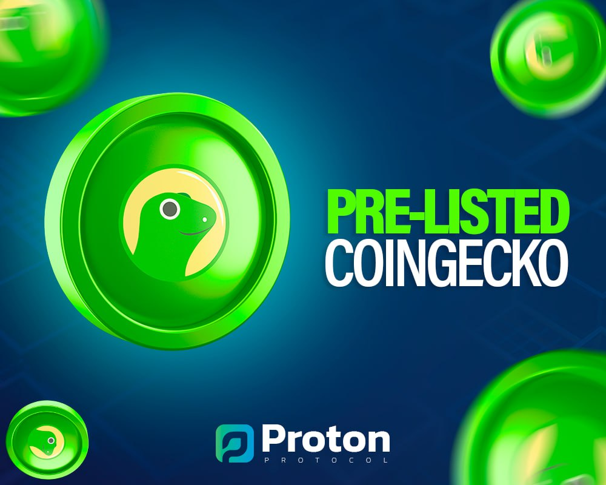
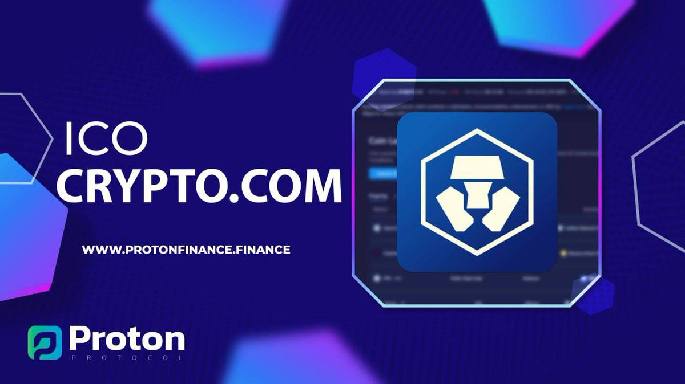

# 🔹 Listing

<figure><figcaption></figcaption></figure>

 

<figure><figcaption></figcaption></figure>

* _Proton Protocol's marketing strategy of pre-listing with CoinGecko and CoinMarketCap provides a range of benefits for the project. Firstly, it provides Proton Protocol with exposure to a wider audience of investors and traders, helping to increase awareness of the project and its potential. Both CoinGecko and CoinMarketCap are highly respected and widely used platforms in the cryptocurrency industry, providing a valuable source of credibility and legitimacy for the Proton Protocol project._
* _Finally, being pre-listed on these platforms can help to attract the attention of other cryptocurrency exchanges and trading platforms, potentially leading to additional listings and trading opportunities for Proton Protocol._
* _Overall, the marketing strategy of pre-listing with CoinGecko and CoinMarketCap provides a range of benefits for Proton Protocol, including increased exposure, improved visibility, improved accessibility to information, and potential opportunities for additional listings and trading opportunities._

#### WE ARE LISTED ON [http://CRYPTO.COM](https://t.co/yQYVVQasJi) AS A ICO PROJECT!!! AFTER PCS LISTING IT WILL BE TRACKING US

<figure><figcaption></figcaption></figure>
