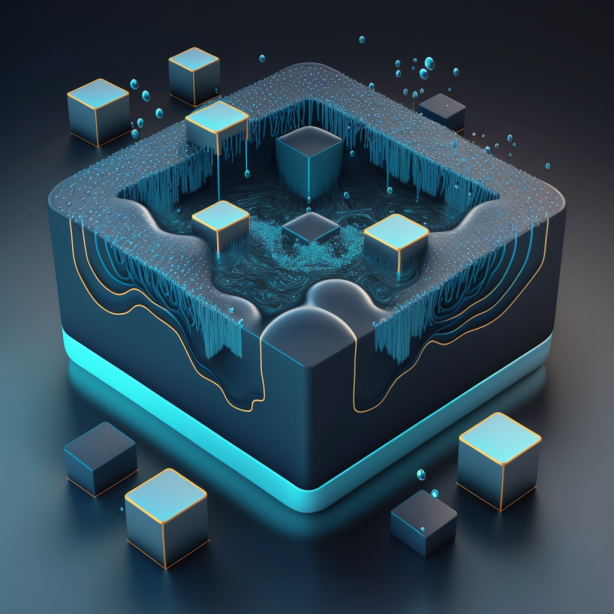
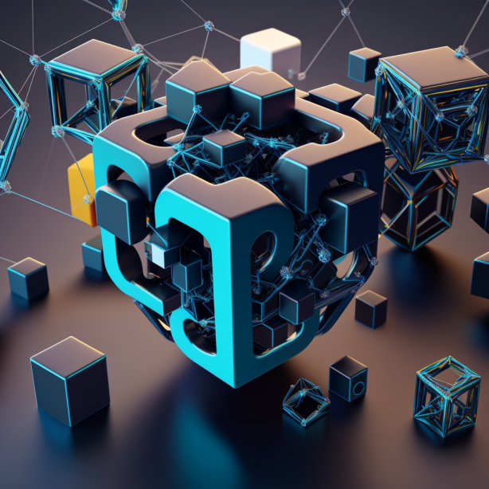

# 🔹 NFT Staking

#### _NFT staking with Proton Protocol._

* _Proton Protocol is a decentralized finance (DeFi) platform built on the blockchain that allows users to stake their Non-Fungible Tokens (NFTs) in return for rewards. NFTs are unique digital assets that are verified on the blockchain, and they can be used to represent a wide range of items, such as art, collectibles, and in-game items._
*   _When users stake their NFTs with Proton Protocol, they receive a proportional share of the platform's transaction fees. The amount of rewards users receive is based on the duration of their staking period, as well as the number and value of the NFTs they stake._

    _One benefit of NFT staking with Proton Protocol is that it provides users with a way to earn passive income on their NFT holdings. Instead of simply holding onto their NFTs, users can earn additional tokens by staking them on the Proton Protocol platform._



<figure><figcaption>
Proton Protocol - Special #1
</figcaption></figure>

 

<figure><figcaption>
Proton Protocol - Special #2
</figcaption></figure>

 

<figure><figcaption>
Proton Protocol - Special #3
</figcaption></figure>

<figure><figcaption>
Proton Protocol #1
</figcaption></figure>

 

<figure><figcaption>
Proton Protocol #2
</figcaption></figure>

* _Additionally, staking NFTs with Proton Protocol helps to support the overall network by providing liquidity and supporting transaction processing. This can help to increase the overall value and utility of the platform, which can benefit all users who hold tokens or use the platform's services._
* _Overall, NFT staking with Proton Protocol is an innovative way to earn rewards and support a decentralized finance platform that is dedicated to providing secure and transparent financial services to users around the world._

<figure><figcaption>
Mystery Box #1
</figcaption></figure>

 

<figure><figcaption>
Mystery Box #2
</figcaption></figure>

 

<figure><figcaption>
Mystery Box #3
</figcaption></figure>

_The Proton Protocol is a blockchain-based project that aims to provide fast and efficient transactions for financial services, including staking, DeFi, and NFTs. In terms of staking NFTs, Proton provides a unique solution that allows NFT holders to earn rewards for holding their NFTs._

#### Here are the mechanics and application for staking in NFTs using the Proton Protocol:

* _NFT Creation and Minting: The first step in staking NFTs using Proton is to create and mint your NFT. You can create your NFT using any platform that supports BSC as OpenSea._
* _Staking: Once you have your NFT, you can stake it on the Proton Protocol. Staking NFTs involves locking up your NFT for a period of time in exchange for rewards. The longer you stake your NFT, the higher the rewards you earn._
* _Rewards: The rewards you earn for staking your NFT are in the form of PROTON tokens, which is the native token of the Proton Protocol. PROTON tokens can be used for various purposes, such as transaction fees, staking, and DeFi applications._
* _Unstaking: When you want to unstake your NFT, you can do so at any time. However, there may be a penalty for unstaking your NFT before the staking period is over. This penalty is to discourage people from unstaking their NFTs too soon and to encourage them to hold onto their NFTs for longer periods of time._\
